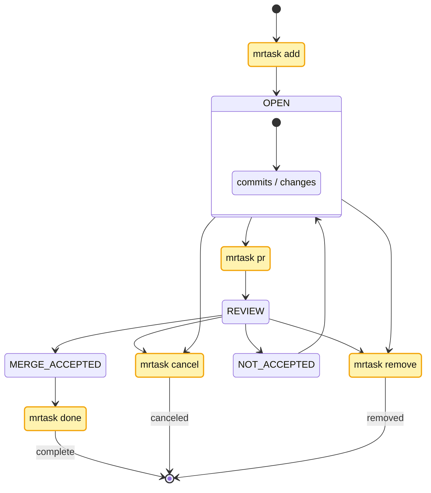
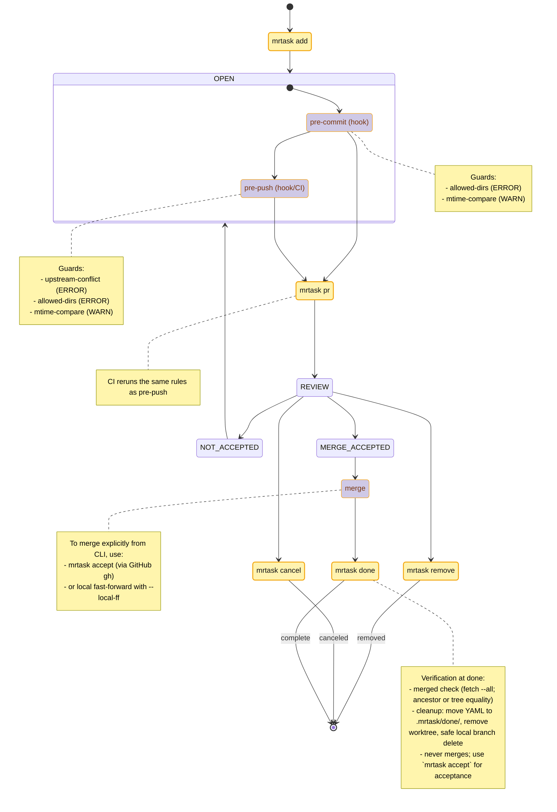
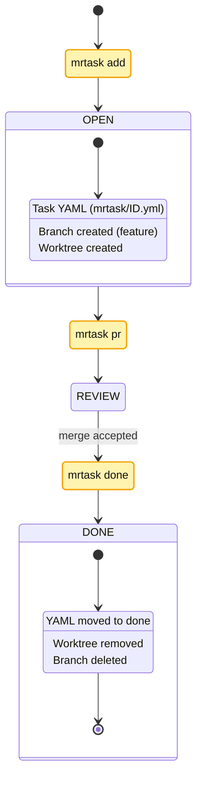
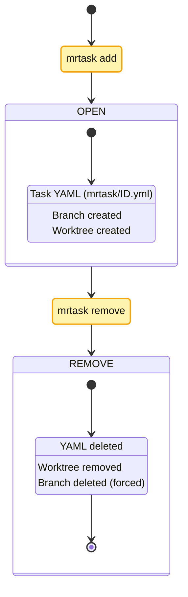

# mrtask — Parallel Development for Monorepos with git worktree

[](https://www.npmjs.com/package/mrtask)
[]

`mrtask` is a small CLI that lets teams develop multiple features in parallel in a mono-repo using git worktree. It creates isolated, task‑scoped worktrees, tracks each task with a simple YAML file, and adds lightweight guardrails to keep changes focused and conflict‑free.

It now integrates with [dep‑fence](https://github.com/kubohiroya/dep-fence) (v0.3.x) to provide predictable “before commit/push” checks that are easy to understand and configure.


## Why mrtask?

Mono-repos make cross‑package changes easy, but they also invite accidental scope creep and tricky merges. Common needs:

- Work on multiple tasks in parallel without stepping on each other.
- Keep each task’s changes constrained to intended directories.
- Avoid push surprises when upstream moved.
- Keep a lightweight, machine‑readable record of what a branch is for.

`mrtask` layers a simple lifecycle and guardrails on top of `git worktree` so teams can move fast with confidence.

---

## Workflow Overview

“CMD nodes = mrtask commands; others = repo/GitHub states”



## Core Ideas

- Task = a small, focused unit of work tracked by a `.mrtask/<id>.yml` file.
- Logical branch is stable (the task identity); physical branches are auto‑unique per worktree.
- Isolated worktrees let you context‑switch without cross‑polluting `node_modules` or build artifacts.
- Guardrails run at pre-commit and pre-push to keep changes on the rails.

---

## Features

- Creates and manages task‑scoped git worktrees.
- Stores task metadata (title, dirs, branch, tags) in YAML.
- Generates PR drafts from the task + current diff.
- Integrates dep‑fence guards for safe, predictable checks:
  - allowed‑dirs (pre-commit/pre-push)
  - mtime‑compare (warn by default)
  - upstream‑conflict (pre-push/CI)
 - Safe close-out: `mrtask done` verifies that the branch is merged before cleaning up (never merges by itself).
 - Explicit acceptance: `mrtask accept` can merge a PR via GitHub CLI (or optional local fast‑forward).

---

## Requirements

- Git ≥ 2.20 (git worktree)
- Node.js ≥ 18
- A workspace tool like pnpm/yarn/npm is recommended

---

## Installation

```bash
npm install -g mrtask
# or
pnpm add -g mrtask
# or
yarn global add mrtask

mrtask --help
```

---

## Quick Start

1) Create a task worktree

```bash
mrtask add feature/login-ui login-ui -d "Implement login form" packages/app
```

2) Install Git hooks (recommended)

```bash
pnpm run hooks:install  # adds pre-commit / pre-push that run the guards
```

3) Open a PR when ready

```bash
# Preview (no git side effects)
mrtask pr <id> --dry-run

# Then actually push upstream and open/compare as needed
mrtask pr <id> --push --no-dry-run
```

4) Wrap up

```bash
mrtask done <id>   # archives YAML to done/, removes worktree, deletes branch
```

---

### Guard Timeline (where checks run)

The main diagram stays intentionally simple. This companion diagram shows exactly where guard checks execute and which rules run.



Why two diagrams?
- The main diagram teaches the lifecycle fast, without visual noise.
- The guard timeline makes enforcement explicit for those wiring hooks/CI.

---

## Guardrails (dep‑fence 0.3.x)

`mrtask` runs a thin guard runner and uses guard rules from `dep-fence/guards`. Configure all rules in a single file at the repo root:

- `.mrtask/dep-fence.config.ts` (default)
- Override with `DEP_FENCE_CONFIG=/path/to/config.ts`

Run modes
- `pre-commit` — checks staged files (local hygiene)
- `pre-push` — checks for upstream conflicts and scope creep (team safety)
- `manual` — on demand run for CI or local checks

Install hooks

```bash
pnpm run hooks:install
```

Run manually

```bash
pnpm run guard -- --mode pre-commit
pnpm run guard -- --mode pre-push
```

CI example (GitHub Actions)

```yaml
- name: dep-fence (pre-push parity)
  run: pnpm run guard -- --mode pre-push
```

### The Three Rules

1) allowed‑dirs
- Purpose: prevent unrelated, cross‑repo‑area changes from slipping into a commit.
- Behavior: in pre-commit, fails if any staged file falls outside allowed globs.
- Config: `allow: string[]`, `action: 'error'|'warn'`

2) mtime‑compare (lightweight)
- Purpose: gently warn when code changed after the guard/SSOT changed.
- Behavior: if any file in `groupA` is newer than the max mtime in `groupB`, warn/error.
- Config: `groupA`, `groupB`, `epsilonMs`, `onlyTracked`, `action`

3) upstream‑conflict (optimistic)
- Purpose: block pushes if other authors modified protected files since your merge‑base.
- Behavior: checks commits since merge‑base against `watch` globs; fails on foreign authors.
- Config: `watch`, `baseRef`, `allowedAuthors`, `action`

Recommended defaults
- pre-commit: allowed‑dirs (error), mtime‑compare (warn)
- pre-push: upstream‑conflict (error), allowed‑dirs (error), mtime‑compare (warn)

Optional: per‑worktree session

Add `.mrtask/session.json` to narrow `allow`/`watch` for a specific worktree:

```json
{
  "allow": ["packages/foo/**", "packages/shared/**", "tools/types/**"]
}
```

---

## Commands (Quick Reference)

`mrtask init`
- Initialize or print the home path used by integrations. Optional for most users.

`mrtask add <branch> <slug> [-d <text>] <dir1> [dir2..]`
- Create task YAML, a feature branch, and a worktree. Supports `--sparse`, `--dry-run`, `--silent`, and CSV via `-t <file.csv:line>`.

`mrtask list [--all] [--status <open|done|cancelled>] [--short]`
- List tasks discovered under workspace packages.

`mrtask show <id>`
- Show details of one task.

`mrtask dump [--all] [--status <status>] [--ndjson]`
- Machine‑friendly JSON/NDJSON of tasks for automation.

`mrtask pr <id|path> [--base main] [--remote origin] [--push] [--draft] [--open] [--dry-run]`
- Build a PR draft from the task + current diff. With `--push`, sets upstream and prints/open compare/PR. With `--dry-run`, no git operations are performed (e.g. `--push` is ignored).

`mrtask done <id>`
- Verify merged state, then move YAML to `.mrtask/done/`, remove worktree, delete branch safely.
- If not merged, it refuses and prints hints to create/merge a PR or to use `mrtask accept`.

`mrtask cancel <id>`
- Mark canceled: move YAML to `.mrtask/cancel/`, remove worktree, force‑delete branch.

`mrtask remove <id>`
- Delete record entirely: delete YAML, remove worktree, force‑delete branch.

`mrtask accept <id|path> [--strategy squash|merge|rebase] [--delete-branch] [--yes] [--base main] [--remote origin] [--local-ff]`
- Merge acceptance step (opt‑in). Uses GitHub CLI (`gh`) to merge the open PR for the branch, or tries a local fast‑forward when `--local-ff` is set.
- Keep this separate from `done` to respect repo policies (branch protection, merge queues, squash/rebase preferences).

`mrtask doctor`
- Check for orphaned worktrees, broken links, invalid YAML.

---

## Examples

Happy path (add → pr → done)



Guards: See “Guard Timeline”. Pre-commit runs before commits; pre-push/CI runs before PR/push.

Cancel path (add → pr → cancel)


Guards: See “Guard Timeline”. Same pre-commit and pre-push coverage applies.

Remove path (add → remove)



Guards: See “Guard Timeline”. Pre-commit still applies; no PR/push in this path.

---

## Troubleshooting

- Guards are too strict and block work
  - Start with `mtime-compare` at `warn`, and invest in good `allow` globs for `allowed-dirs`.
- upstream‑conflict keeps failing
  - `git fetch --all` and rebase/merge as needed. The rule fails when protected files have upstream changes by other authors since your base.
- Unexpected path excluded by a glob
  - Review order and negations in `.mrtask/dep-fence.config.ts`. Put `!` exclusions last for readability.
- `mrtask done` says "Not merged"
  - Create/merge a PR first: `mrtask pr <id> --push --open` and merge on the platform, or run `mrtask accept <id> --strategy squash` to merge via GitHub CLI. Then run `mrtask done <id>` again.

---

## Design Notes

- Logical branch names stay constant; physical branches get auto‑unique suffixes for multiple worktrees.
- SSOT: per‑package `.mrtask/` stays in `main`. Guard config lives centrally at `.mrtask/dep-fence.config.ts`.
- Hooks focus on staged changes at pre-commit; pre-push/CI re‑checks with upstream awareness.
- Rules are path/glob based with no hidden timing or freshness heuristics beyond optional mtime tolerance.

---

## Author

Hiroya Kubo <hiroya@cuc.ac.jp>

## License

MIT — see `LICENSE`.

---

## Related Sites

- mrtask (GitHub): https://github.com/kubohiroya/mrtask
- mrtask (npm): https://www.npmjs.com/package/mrtask
- dep-fence (GitHub): https://github.com/kubohiroya/dep-fence
- dep-fence (npm): https://www.npmjs.com/package/dep-fence
