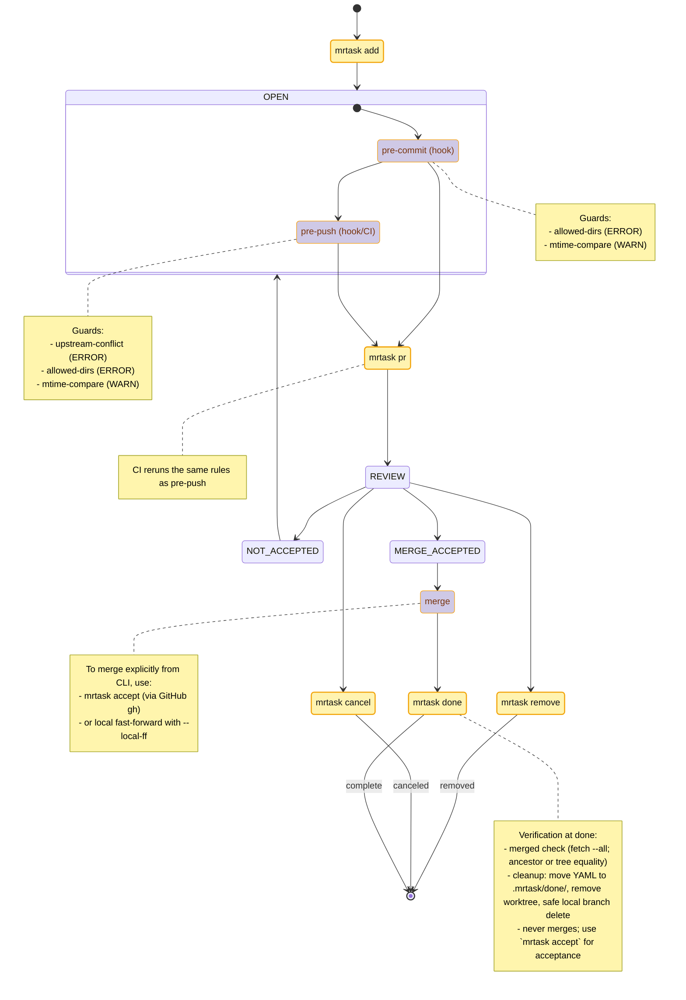
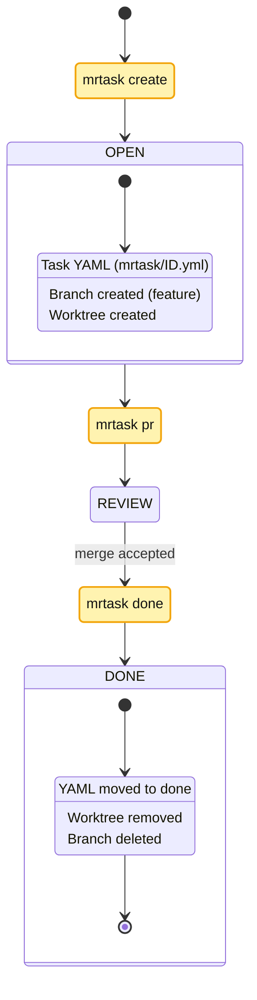
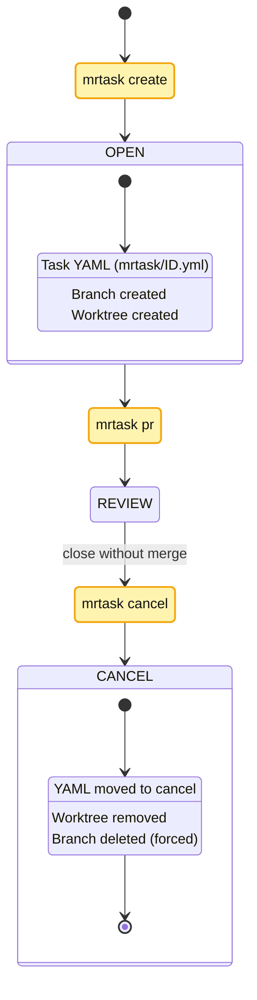
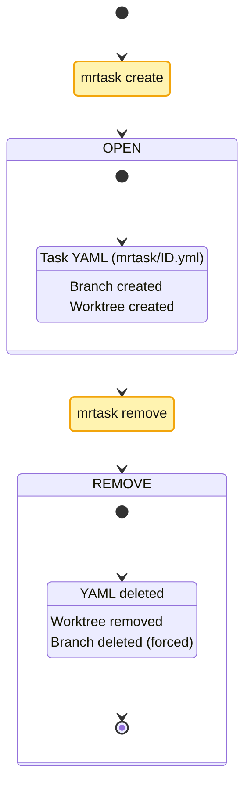

# mrtask — Parallel Development for Monorepos with git worktree

[](https://www.npmjs.com/package/mrtask)
[]

`mrtask` is a small CLI that lets teams develop multiple features in parallel in a mono-repo using git worktree. It creates isolated, task‑scoped worktrees, tracks each task with a simple YAML file, and adds lightweight guardrails to keep changes focused and conflict‑free.

It now integrates with [dep‑fence](https://github.com/kubohiroya/dep-fence) (v0.3.x) to provide predictable “before commit/push” checks that are easy to understand and configure.


## Why mrtask?

Mono-repos make cross‑package changes easy, but they also invite accidental scope creep and tricky merges. Common needs:

- Work on multiple tasks in parallel without stepping on each other.
- Keep each task’s changes constrained to intended directories.
- Avoid push surprises when upstream moved.
- Keep a lightweight, machine‑readable record of what a branch is for.

`mrtask` layers a simple lifecycle and guardrails on top of `git worktree` so teams can move fast with confidence.

---

## Workflow Overview

“CMD nodes = mrtask commands; others = repo/GitHub states”


## Core Ideas

- Task = a small, focused unit of work tracked by a `.mrtask/<id>.yml` file.
- Logical branch is stable (the task identity); physical branches are auto‑unique per worktree.
- Isolated worktrees let you context‑switch without cross‑polluting `node_modules` or build artifacts.
- Guardrails run at pre-commit and pre-push to keep changes on the rails.

---

## Features

- Creates and manages task‑scoped git worktrees.
- Stores task metadata (title, dirs, branch, tags) in YAML.
- Generates PR drafts from the task + current diff.
- Integrates dep‑fence guards for safe, predictable checks:
  - allowed‑dirs (pre-commit/pre-push)
  - mtime‑compare (warn by default)
  - upstream‑conflict (pre-push/CI)
 - Safe close-out: `mrtask done` verifies that the branch is merged before cleaning up (never merges by itself).
 - Explicit acceptance: `mrtask accept` can merge a PR via GitHub CLI (or optional local fast‑forward).

---

## Requirements

- Git ≥ 2.20 (git worktree)
- Node.js ≥ 18
- A workspace tool like pnpm/yarn/npm is recommended

---

## Installation

```bash
npm install -g mrtask
# or
pnpm add -g mrtask
# or
yarn global add mrtask

mrtask --help
```

---

## Quick Start

At a glance

- Default safety: most commands are dry‑run friendly; use `--no-dry-run` for side effects.
- IDE‑friendly: worktrees are created next to your repo (sibling) by default.
- Clear scope: directory guards keep changes inside intended packages.
- Easy targeting: you can address a task by YAML path, id/prefix, or the 8‑char short hash shown in `mrtask list`. Omitting an id targets “the task of the current worktree/branch”.

1) Create an isolated task worktree

```bash
mrtask create feature/login-ui login-ui -d "Implement login form" packages/app
```

2) Install Git hooks (recommended)

```bash
pnpm run hooks:install  # adds pre-commit / pre-push that run the guards
```

3) Open a PR when ready

```bash
# Preview (no git side effects)
mrtask pr <id> --dry-run

# Then actually push upstream and open/compare as needed
mrtask pr <id> --push --no-dry-run
```

4) Wrap up

```bash
mrtask done <id>   # archives YAML to done/, removes worktree, deletes branch
```

---

## Daily Flow (Happy Paths)

Single‑task flow (create → pr → done)

```bash
# create a task for packages/app and start coding in the new worktree
mrtask create feature/login-ui login-ui -d "Implement login form" packages/app

# commit changes inside the worktree; guards warn/block if you touch outside allowed dirs
git add -A && git commit -m "feat(app): implement login"

# create PR (from inside the worktree; no id needed)
mrtask pr --push --draft --open --no-dry-run

# after merge, clean up (inside any directory)
mrtask done --taskid <short8>
```

Cancel (close without merge)

```bash
mrtask cancel --taskid <short8>
```

Remove (delete record/worktree/branch)

```bash
mrtask remove --taskid <short8>
```

---

## Concepts & Defaults

- Worktree placement
  - Default is sibling: `<repo-parent>/<repo-name>-wt/<task-id>`.
  - Switch with `--wt-mode home|repo-subdir` at `add` time.
  - All historical locations are auto‑detected for cleanup (`.mrtask/wt/<id>`, `$MRTASK_HOME/...`, `<repo>/.worktrees/<id>`, sibling).

- Target resolution (which task?):
  - Omitting an id on `pr/done/cancel/remove` resolves to the task of the current worktree/branch.
  - You can also specify `--task <yaml>`, `--taskid <id|short8>`, `--branch <name>`, or `--worktree <path>`.

- ID formats
  - YAML path, full id, id prefix, 8‑char short hash (as shown by `mrtask list`).

- Guards (directory change policy)
  - YAML: `guards: { level: ignore|warn|error }`; legacy `--strict/--no-strict` map to `error/warn` and are deprecated.
  - For isolated tasks (create) you can explicitly set guards via `--guards` when creating.
  - For shared tasks (add) the branch’s guard config is auto‑recomputed as the union of open tasks on that branch. Use `--guards ignore|warn|error` to set the per‑task preference written into YAML.

- Dry‑run by default
  - `mrtask pr` (and `ci`) are safe to run without side effects until `--no-dry-run` is passed. `--dry-run` is the default for these commands.

---

## Worktree Layout (Before/After)

Below shows how the filesystem changes with the default sibling placement. Replace `<repo>` with your repository name and `<task-id>` with the generated task id.

Example context

```text
/projects/
  <repo>/            # your main working copy (on main)
  <repo>-wt/         # worktrees live here (created on demand)
```

### create — creates a sibling worktree (isolated)

Command

```bash
cd /projects/<repo>
mrtask create feature/login-ui login-ui packages/app
```

Before

```text
/projects/
  <repo>/
    .git/
    packages/
      app/
        (no .mrtask yet)
```

After

```text
/projects/
  <repo>/
    .git/
    packages/
      app/
        .mrtask/
          <task-id>.yml           # task metadata is versioned in main

  <repo>-wt/
    <task-id>/                    # new worktree checked out on feature/login-ui
      (package layout mirrors repo; edit here for this task)
```

Notes
- The task YAML is placed under the primary package (`packages/app/.mrtask/<task-id>.yml`) for discoverability on main.
- The worktree is a separate checkout at `/projects/<repo>-wt/<task-id>`.

### add — add a shared (lightweight) task under an existing worktree

Use when you want to track sub‑tasks without creating more worktrees. The YAML is created under the target package, guards are auto‑recomputed for the branch, and no new worktree is created.

```bash
# choose a parent explicitly by YAML / id / short8
mrtask add child-qa packages/app --parent ./.mrtask/<parent-id>.yml

# or let mrtask auto‑select a parent on the same branch based on dir match
mrtask add child-qa packages/app
```

 Output shows:
 - `✔ Added shared task <id>`
 - `YAML: packages/app/.mrtask/<child-id>.yml`
 - `Worktree: <resolved-parent-worktree> on branch <branch>`

### add (shared) — no new worktree (before/after)

Command

```bash
cd /projects/<repo>
# assume you already have a parent task/worktree on feature/login-ui
mrtask add child-qa packages/app --parent ./.mrtask/<parent-id>.yml
```

Before

```text
/projects/
  <repo>/
    packages/app/
      (no child YAML yet)
  <repo>-wt/
    <parent-id>/                 # existing worktree on feature/login-ui
```

After

```text
/projects/
  <repo>/
    packages/app/
      .mrtask/
        <child-id>.yml           # new shared subtask YAML on main
  <repo>-wt/
    <parent-id>/                 # unchanged (no new worktree is created)
      .mrtask/dep-fence.config.ts  # guards updated to union of open tasks
```

Notes
- Shared tasks do not create additional worktrees; they live under their parent’s branch/worktree.
- Use `mrtask list` on main to see parents with their subtasks (hierarchical by default). Use `--flat` for a flat view.

### done — removes worktree, archives YAML to done/

Command

```bash
mrtask done --taskid <short8>
```

Before

```text
/projects/
  <repo>/
    packages/app/.mrtask/
      <task-id>.yml
  <repo>-wt/
    <task-id>/
```

After

```text
/projects/
  <repo>/
    packages/app/.mrtask/
      done/
        <task-id>.yml             # archived record
  <repo>-wt/
    (worktree removed)
```

### cancel — removes worktree, archives YAML to cancel/

Command

```bash
mrtask cancel --taskid <short8>
```

Before

```text
/projects/
  <repo>/
    packages/app/.mrtask/
      <task-id>.yml
  <repo>-wt/
    <task-id>/
```

After

```text
/projects/
  <repo>/
    packages/app/.mrtask/
      cancel/
        <task-id>.yml             # archived as canceled
  <repo>-wt/
    (worktree removed)
```

### remove — removes worktree and deletes YAML

Command

```bash
mrtask remove --taskid <short8>
```

Before

```text
/projects/
  <repo>/
    packages/app/.mrtask/
      <task-id>.yml
  <repo>-wt/
    <task-id>/
```

After

```text
/projects/
  <repo>/
    packages/app/.mrtask/
      (no <task-id>.yml)          # record removed
  <repo>-wt/
    (worktree removed)
```

Tips
- You can target a task by omitting the id inside its worktree, or explicitly via `--task`, `--taskid`, `--branch`, or `--worktree`.
- Historical locations for worktrees (`.mrtask/wt/<id>`, `$MRTASK_HOME/...`, `<repo>/.worktrees/<id>`) are also detected during cleanup.

---

### Guard Timeline (where checks run)

The main diagram stays intentionally simple. This companion diagram shows exactly where guard checks execute and which rules run.



Why two diagrams?
- The main diagram teaches the lifecycle fast, without visual noise.
- The guard timeline makes enforcement explicit for those wiring hooks/CI.

---

## Guards & Policies (dep‑fence 0.3.x)

`mrtask` runs a thin guard runner and uses guard rules from `dep-fence/guards`. Configure all rules in a single file at the repo root:

- `.mrtask/dep-fence.config.ts` (default)
- Override with `DEP_FENCE_CONFIG=/path/to/config.ts`

Run modes
- `pre-commit` — checks staged files (local hygiene)
- `pre-push` — checks for upstream conflicts and scope creep (team safety)
- `manual` — on demand run for CI or local checks

Install hooks

```bash
pnpm run hooks:install
```

Run manually

```bash
pnpm run guard -- --mode pre-commit
pnpm run guard -- --mode pre-push
```

CI example (GitHub Actions)

```yaml
- name: dep-fence (pre-push parity)
  run: pnpm run guard -- --mode pre-push
```

### The Three Rules

1) allowed‑dirs
- Purpose: prevent unrelated, cross‑repo‑area changes from slipping into a commit.
- Behavior: in pre-commit, fails if any staged file falls outside allowed globs.
- Config: `allow: string[]`, `action: 'error'|'warn'`

2) mtime‑compare (lightweight)
- Purpose: gently warn when code changed after the guard/SSOT changed.
- Behavior: if any file in `groupA` is newer than the max mtime in `groupB`, warn/error.
- Config: `groupA`, `groupB`, `epsilonMs`, `onlyTracked`, `action`

3) upstream‑conflict (optimistic)
- Purpose: block pushes if other authors modified protected files since your merge‑base.
- Behavior: checks commits since merge‑base against `watch` globs; fails on foreign authors.
- Config: `watch`, `baseRef`, `allowedAuthors`, `action`

Recommended defaults
- pre-commit: allowed‑dirs (error), mtime‑compare (warn)
- pre-push: upstream‑conflict (error), allowed‑dirs (error), mtime‑compare (warn)

Optional: per‑worktree session

Add `.mrtask/session.json` to narrow `allow`/`watch` for a specific worktree:

```json
{
  "allow": ["packages/foo/**", "packages/shared/**", "tools/types/**"]
}
```

---

## Commands (Quick Reference)

`mrtask init`
- Initialize or print the home path used by integrations. Optional for most users.

`mrtask create <branch> <slug> [-d <text>] <dir1> [dir2..]`
- Create an isolated task: feature branch, worktree, and YAML.
  - `--guards <ignore|warn|error>`: directory guards level written to YAML
  - `--wt-mode <sibling|home|repo-subdir>`: worktree placement (default: sibling)
  - `--sparse`, `--dry-run`, `--silent`, CSV via `-t <file.csv:line>`

`mrtask add <slug> [-d <text>] <dir1> [dir2..] [--parent <id|short8|yaml>]`
- Add a shared task: create YAML only, reusing an existing worktree on the branch.
  - Auto-selects a parent on the same branch by dir match when `--parent` is omitted.
  - Recomputes branch guards as the union of open tasks; `--guards` writes the per-task preference.
  - Deprecated: `--strict`/`--no-strict` map to `error/warn` and are deprecated.

`mrtask list [--all] [--status <open|done|cancelled>] [--short]`
- List tasks discovered under workspace packages.

`mrtask show <id>`
- Show details of one task.

`mrtask dump [--all] [--status <status>] [--ndjson]`
- Machine‑friendly JSON/NDJSON of tasks for automation.

`mrtask pr [id|path] [--base main] [--remote origin] [--push] [--draft] [--open] [--dry-run|--no-dry-run] [--task <yaml>] [--taskid <id>] [--branch <name>] [--worktree <path>]`
- Build a PR draft from the task + current diff. With `--push`, sets upstream and prints/open compare/PR. With `--dry-run`, no git operations are performed (e.g. `--push` is ignored).
 - Accepts: YAML path / id prefix / 8-char short hash (as shown by `mrtask list`).

`mrtask ci <id|path> [--template .github/workflows/dep-fence-guards.yml] [--add <glob...>] [--message <msg>] [--base main] [--remote origin] [--draft] [--open] [--dry-run|--no-dry-run]`
- Bootstrap CI workflow into the task’s worktree, stage optional files, commit, push, and create/open a PR.
  - Defaults to `--dry-run`; use `--no-dry-run` to execute.
  - Typical: `mrtask ci --add "packages/*/UNUSED_*" --template .github/workflows/dep-fence-guards.yml --push --draft --open --no-dry-run`

`mrtask done [id] [--task <yaml>] [--taskid <id>] [--branch <name>] [--worktree <path>]`
- Verify merged state, then move YAML to `.mrtask/done/`, remove worktree, delete branch safely.
- If not merged, it refuses and prints hints to create/merge a PR or to use `mrtask accept`.
 - Accepts: YAML path / id prefix / 8-char short hash.

`mrtask cancel [id] [--task <yaml>] [--taskid <id>] [--branch <name>] [--worktree <path>]`
- Mark canceled: move YAML to `.mrtask/cancel/`, remove worktree, force‑delete branch.
 - Accepts: YAML path / id prefix / 8-char short hash.

`mrtask remove [id] [--task <yaml>] [--taskid <id>] [--branch <name>] [--worktree <path>]`
- Delete record entirely: delete YAML, remove worktree, force‑delete branch.
 - Accepts: YAML path / id prefix / 8-char short hash.

`mrtask accept <id|path> [--strategy squash|merge|rebase] [--delete-branch] [--yes] [--base main] [--remote origin] [--local-ff]`
- Merge acceptance step (opt‑in). Uses GitHub CLI (`gh`) to merge the open PR for the branch, or tries a local fast‑forward when `--local-ff` is set.
- Keep this separate from `done` to respect repo policies (branch protection, merge queues, squash/rebase preferences).

`mrtask doctor`
- Check for orphaned worktrees, broken links, invalid YAML.

---

### Guards in YAML

When specified, the task YAML includes:

```yaml
guards:
  level: warn # or error|ignore
```

If omitted, the default behavior is equivalent to `warn` but the field is not written.

---

## Examples

Happy path (add → pr → done)



Guards: See “Guard Timeline”. Pre-commit runs before commits; pre-push/CI runs before PR/push.

Cancel path (add → pr → cancel)



Guards: See “Guard Timeline”. Same pre-commit and pre-push coverage applies.

Remove path (add → remove)



Guards: See “Guard Timeline”. Pre-commit still applies; no PR/push in this path.

---

## Troubleshooting

- Guards are too strict and block work
  - Start with `mtime-compare` at `warn`, and invest in good `allow` globs for `allowed-dirs`.
- upstream‑conflict keeps failing
  - `git fetch --all` and rebase/merge as needed. The rule fails when protected files have upstream changes by other authors since your base.
- Unexpected path excluded by a glob
  - Review order and negations in `.mrtask/dep-fence.config.ts`. Put `!` exclusions last for readability.
- `mrtask done` says "Not merged"
  - Create/merge a PR first: `mrtask pr <id> --push --open` and merge on the platform, or run `mrtask accept <id> --strategy squash` to merge via GitHub CLI. Then run `mrtask done <id>` again.

---

## Design Notes

- Logical branch names stay constant; physical branches get auto‑unique suffixes for multiple worktrees.
- SSOT: per‑package `.mrtask/` stays in `main`. Guard config lives centrally at `.mrtask/dep-fence.config.ts`.
- Hooks focus on staged changes at pre-commit; pre-push/CI re‑checks with upstream awareness.
- Rules are path/glob based with no hidden timing or freshness heuristics beyond optional mtime tolerance.

---

## Author

Hiroya Kubo <hiroya@cuc.ac.jp>

## License

MIT — see `LICENSE`.

---

## Related Sites

- mrtask (GitHub): https://github.com/kubohiroya/mrtask
- mrtask (npm): https://www.npmjs.com/package/mrtask
- dep-fence (GitHub): https://github.com/kubohiroya/dep-fence
- dep-fence (npm): https://www.npmjs.com/package/dep-fence
