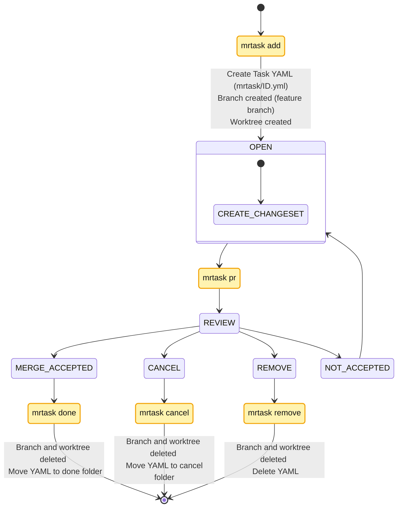
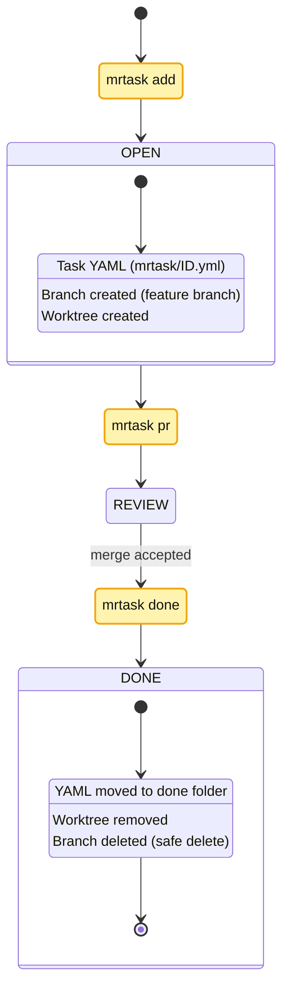
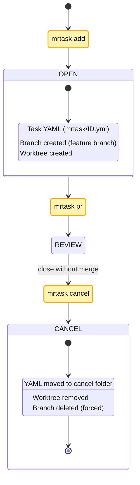
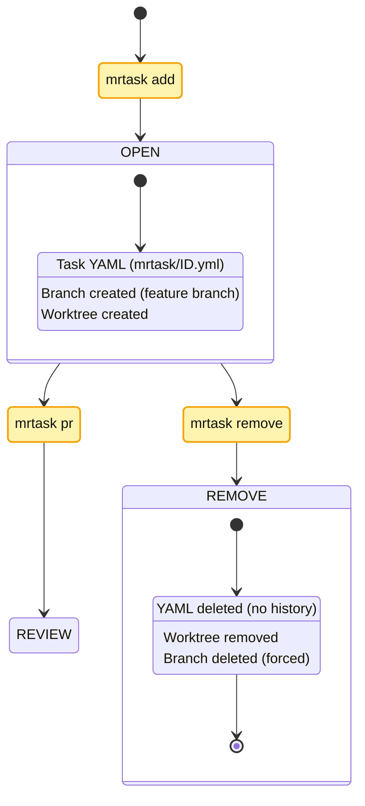
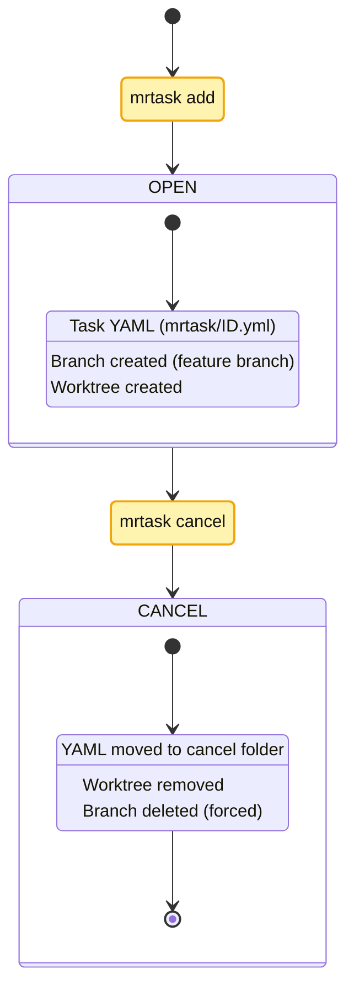
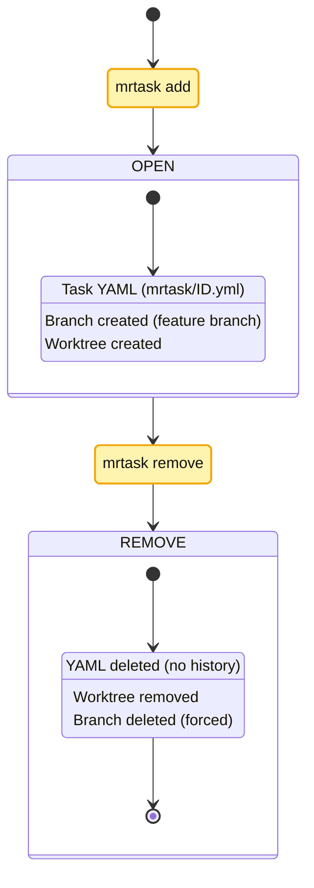

# mrtask 🚀

`mrtask` (Mono-Repo Task Manager) is a command-line tool that helps developers manage **task-specific worktrees** in mono-repositories.  
It integrates with `git worktree` to create isolated working directories for feature branches, and stores structured task metadata in `.mrtask/` files.

---

## ✨ Motivation

When working in a mono-repo with multiple packages, it’s common to:
- 🛠️ Work on multiple tasks in parallel.
- 🧹 Keep tasks isolated to avoid mixing unrelated changes.
- 📝 Track the purpose and scope of each task.

`mrtask` provides a **lightweight task lifecycle** on top of `git worktree`,  
with YAML metadata that makes tasks searchable, sharable, and automatable.

---

## 🔑 Features

- 🏠 `mrtask init` — initialize MRTASK_HOME and workTrees base with a setup guide (optional, skip to use default)
- ➕ `mrtask add` — create a task YAML and a git worktree (prints YAML; supports --dry-run/--silent)
- 📋 `mrtask list/show/dump` — query tasks across workspaces
- 🔀 `mrtask pr` — build a PR draft from Task + Git diff, optionally `--push` the branch and open compare/PR (GitHub gh optional)
- ✅ `mrtask done/cancel/remove` — move or delete task records, remove worktrees
- 🩺 `mrtask doctor` — basic integrity checks

## ⭐️ Usage Flow (overview)




---

## 📦 Installation

Install from npm:

    npm install -g mrtask
    # or
    pnpm add -g mrtask
    # or
    yarn global add mrtask

After installation, the `mrtask` command will be available in your shell:

    mrtask --help
    mrtask --version

### Requirements
- 🐙 Git ≥ 2.20 (for `git worktree` support)  
- 🟢 Node.js ≥ 18  
- 📦 A mono-repo managed with `pnpm`, `yarn`, or `npm` workspaces is recommended

---

## 🖥️ Usage

### 🏠 `mrtask init`

Optionally initialize MRTASK_HOME. Most users don’t need this — run it only if you want to customize the default home path used by future integrations.

    mrtask init [path]

If no path is given, a sensible OS-specific default is used:
- Windows: `%APPDATA%/mrtask`
- macOS: `~/Library/Application Support/mrtask`
- Linux: `$XDG_CONFIG_HOME/mrtask` or `~/.config/mrtask`

The command prints a short guide to export `MRTASK_HOME` for your shell.

### ➕ `mrtask add`

Create a new task, a corresponding git worktree, and a `.mrtask/<task-id>.yml` metadata file.
On success (including `--dry-run`), the YAML content of the task is printed to stdout. Use `--silent` to suppress it.

    mrtask add <branch-name> <task-name-segment> \
      -d "Task description" <dir1> [dir2...]

**Options**
- 📝 `-d <text>` — task description (inline).  
- 📄 `-f <file.yml>` — use an existing YAML file as the task definition.  
- 📊 `-t <file.csv:line>` — create task from CSV line.  
  - Recognized CSV headers (simplified): `title`, `description`, `branch`, `dir1`, `dir2..dirN`, `slug`. Missing fields are prompted interactively.  
  - With `-t`, positional args are optional; values can come from CSV and prompts.  
- 🌲 `--sparse` — enable sparse-checkout for the listed directories.  
- 🧪 `--dry-run` — preview only; does not create branch/worktree or write files, but prints the YAML that would be written.  
- 🤫 `--silent` — suppress output on success (errors still printed).  
  
CSV directory columns (simple)
- Use `dir1` as the primary directory and `dir2..dirN` for additional directories.
- Older aliases like `dir`, `primaryDir`, or a combined `dirs` column are not supported.

```bash
    mrtask add feature/login-ui login-ui \
      -d "Implement login form with validation" packages/app
    # CSV-only (no positional args)
    mrtask add -t TASKS.csv:2
    # Preview only
    mrtask add feature/login-ui login-ui --dry-run packages/app
```
---

### 📋 `mrtask list`

List tasks across the repository.  
Looks for `.mrtask/` directories in packages defined in `pnpm-workspace.yaml` or workspaces in `package.json`.

    mrtask list [options]

**Options**
- `--all` — show all tasks (open + done + cancelled).  
- `--status <open|done|cancelled>` — filter by status.  
- `--short` — compact one-line format.  

Format
- Default: `open  [short-id] title (N dirs) [branch]` + next line with the YAML path.  
- Short id is an 8-char hash of the full id.  

Human vs. AI
- `list` is optimized for humans. For AI/automation, use `mrtask dump` below.

---

### 🔍 `mrtask show`

Display details of a single task.

    mrtask show <task-id>

**Example**
    mrtask show 2025-09-08T14-03-12Z-feature-login-ui

---
### 🤖 `mrtask dump`

Dump tasks in a machine-friendly JSON format for AI/automation.

    mrtask dump [--all] [--status <status>] [--ndjson]

**Output**
- JSON array (default) or NDJSON when `--ndjson` is set.
- Each object includes: `id`, `id_short`, `title`, `description`, `branch`, `status`, `primaryDir`, `workDirs`, `file`, `createdAt`, `tags`, `checklistCount`.

**Options**
- `--all` — include open + done + cancelled (default: open only).
- `--status <open|done|cancelled>` — filter by status.
- `--ndjson` — newline-delimited JSON (one JSON object per line).
---

### 🔀 `mrtask pr`
Generate a pull request from an existing task (`.mrtask/<id>.yml`) and current git diff.

    mrtask pr <id|task-file-path> [--base main] [--remote origin] [--push] [--draft] [--open] [--dry-run]

**Argument**
- `<id|task-file-path>` — task id (prefix ok) OR direct path to task YAML file

**Options**
- `--dry-run` (default): Print PR draft (Title/Body) and a compare URL if available.
  - Saves the draft to `.mrtask/out/<id>.pr.md`
  - With `--open`, opens the compare URL in a browser.
- `--push`: Push the branch to `<remote>` and set upstream (safe to use with `--dry-run`).
- If GitHub CLI `gh` is available and `--dry-run` is not set:
  - Creates a PR (use `--draft` for draft PRs). Otherwise, prints the compare URL.

```bash
    # Using task ID
    mrtask pr 2025-09-08T14-03-12Z-feature_login-ui --base main --push --dry-run

    # Using direct file path
    mrtask pr packages/app/.mrtask/2025-09-08T14-03-12Z-feature_login-ui.yml --push --dry-run
```
---

### ✅ `mrtask done`

Mark a task as completed.  
Moves the YAML file to `.mrtask/done/` and removes the git worktree.

    mrtask done <task-id>

---

### ❌ `mrtask cancel`

Cancel a task without merging.  
Moves the YAML file to `.mrtask/cancel/` and removes the git worktree.

    mrtask cancel <task-id>

---

### 🗑️ `mrtask remove`

Remove a task entirely (no record kept).  
Deletes the YAML file and removes the git worktree.

    mrtask remove <task-id>

---

### 🩺 `mrtask doctor`

Check the repository for inconsistencies:
- 🏚️ Orphaned worktrees without task files.
- 🔗 Broken symlinks in `.mrtask/`.
- ⚠️ Invalid YAML.

    mrtask doctor

---

### ⚙️ `mrtask config`

Show or edit configuration (e.g. CSV column mapping, default branch).

    mrtask config [options]

---
## 🔄 Examples

### 1) add → pr → done (happy path)
- Flow: create task → open PR (review/merge on GitHub) → run done to archive YAML, remove worktree, and safely delete the branch.



### 2) add → pr → cancel (close PR without merge)
- Flow: create task → open PR (close) → run cancel to move YAML to cancel, remove worktree, and force-delete the branch.



### 3) add → pr → remove (discard task entirely)
- Flow: create task → PR optional → run remove to delete YAML (no history), remove worktree, and force-delete the branch.



### 4) add → cancel (stop without PR)
- Flow: create task → decide to stop → run cancel to archive to cancel, remove worktree, and force-delete the branch.



### 5) add → remove (clean up a mistaken task)
- Flow: create task → realize it’s not needed → run remove to delete YAML, remove worktree, and force-delete the branch.




## Author

Hiroya Kubo <hiroya@cuc.ac.jp>

## 📜 License

MIT — see `LICENSE` for full text.
MIT

